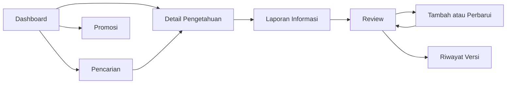

# Pagi Sore KMS — Desktop UI Website Handoff

Dokumen ini menerjemahkan UI desktop pada file Figma **PagiSoreKMS / Page 2** menjadi spesifikasi implementasi website. Desain mengacu pada preset shadcn `b7lkf1G5nc`, delapan frame desktop berukuran `1440 × 900`, serta konteks Knowledge Management System (KMS) Pagi Sore Kota Lama Semarang.

> Seluruh nama promo, nilai transaksi, tanggal, status, dan isi pengetahuan di mockup adalah **data simulasi untuk prototipe akademik**.

## 1. Referensi

- [Figma desktop UI](https://www.figma.com/design/mBZLMyQKRfst9NS5S68a8B/PagiSoreKMS?node-id=9-5754&p=f)
- Prototype statis: `PagiSore_KMS_Shadcn_b7lkf1G5nc/prototype.html`
- SVG sumber: `PagiSore_KMS_Shadcn_b7lkf1G5nc/screens/`
- Preview PNG: `PagiSore_KMS_Shadcn_b7lkf1G5nc/previews/`
- Font lokal: `PagiSore_KMS_Shadcn_b7lkf1G5nc/fonts/`

### Menjalankan prototype referensi

```powershell
cd PagiSore_KMS_Shadcn_b7lkf1G5nc
python -m http.server 8000
```

Buka `http://localhost:8000/prototype.html`.

## 2. Tujuan produk

Website adalah portal staf untuk mengelola pengetahuan layanan yang digunakan pada beberapa touchpoint pelanggan. Pengguna harus dapat:

1. menemukan informasi layanan dengan cepat;
2. memeriksa status aktif, sumber, masa berlaku, versi, dan touchpoint;
3. melihat syarat promo sebelum transaksi;
4. menambah atau memperbarui pengetahuan;
5. mengirim perubahan untuk review;
6. menyetujui atau mengembalikan perubahan;
7. melihat riwayat versi dan audit;
8. melaporkan informasi yang tidak sesuai.

KMS mengelola pengetahuan pendukung layanan. Integrasi POS, pembayaran, delivery, atau parkir hanya ditambahkan jika sumber data dan aksesnya tersedia.

## 3. Stack yang disarankan

- React atau Next.js dengan TypeScript
- Tailwind CSS
- shadcn/ui
- Lucide Icons
- React Hook Form dan schema validation untuk form
- Mock data lokal terlebih dahulu; API dapat ditambahkan setelah struktur data disepakati

Komponen shadcn yang relevan:

| Kebutuhan | Komponen |
|---|---|
| Header navigation | `NavigationMenu`, `Button`, `Avatar` |
| Kartu | `Card` |
| Status | `Badge` |
| Form | `Input`, `Textarea`, `Select`, `DatePicker` |
| Pencarian/filter | `Command`, `Popover`, `Select` |
| Review | `Tabs`, `Separator`, `Button` |
| Riwayat | `Table` atau timeline kustom |
| Konfirmasi | `AlertDialog` |
| Umpan balik | `Toast` atau `Sonner` |
| Loading | `Skeleton` |

## 4. Design tokens

### Warna

```css
:root {
  --background: #09090b;
  --surface: #18181b;
  --surface-muted: #27272a;
  --surface-input: #111113;
  --border: #3f3f46;

  --foreground: #fafafa;
  --foreground-muted: #a1a1aa;
  --foreground-dim: #71717a;

  --primary: #016630;
  --primary-foreground: #f0fdf4;
  --accent: #5ee9b5;
  --accent-dark: #064e3b;

  --success: #86efac;
  --warning: #facc15;
  --destructive: #ff6467;
}
```

Gunakan warna status bersama teks atau ikon. Jangan mengandalkan warna saja.

### Tipografi

```css
--font-body: "DM Sans", Arial, sans-serif;
--font-display: "Instrument Sans", "DM Sans", sans-serif;
```

| Peran | Font | Ukuran desktop | Berat | Catatan |
|---|---|---:|---:|---|
| Display heading | Instrument Sans | 49–58 px | 500–600 | line-height 1.05; tracking sekitar `-2px` |
| Card heading besar | Instrument Sans | 27–39 px | 600 | line-height 1.15 |
| Heading item | DM Sans | 17–22 px | 600–700 |  |
| Body besar | DM Sans | 17–20 px | 400 | line-height 1.5 |
| Body | DM Sans | 13–15 px | 400 | line-height 1.5 |
| Eyebrow | DM Sans | 11 px | 700 | uppercase; tracking `2–2.8px`; warna accent |
| Field label | DM Sans | 10 px | 700 | uppercase; tracking `1.4–1.5px` |

### Bentuk dan efek

- Radius tombol: `8px`
- Radius input: `8px`
- Radius kartu: `10px`
- Border: `1px solid var(--border)`
- Shadow kartu: lembut dan gelap; jangan terlalu kontras
- Fokus keyboard: ring `2px` menggunakan `--accent`
- Background glow: radial gradient `#064e3b` dengan opacity rendah

### Motion

- Perpindahan halaman/konten: opacity `400–440ms`
- Gerak masuk: `translateY(18px)` dan `scale(.986)` selama sekitar `520ms`
- Gerak keluar: `translateY(-12px)` dan `scale(1.008)` selama sekitar `500ms`
- Toast: `250ms`, tampil sekitar `3600ms`
- Hormati `prefers-reduced-motion`

## 5. Layout desktop

- Reference viewport: `1440 × 900`
- Container utama: lebar maksimum `1440px`
- Padding horizontal konten: `74–76px`
- Header: `24px` dari atas, tinggi sekitar `72px`, border bawah pada `y = 95px`
- Eyebrow halaman: sekitar `y = 140px`
- Footer mikro: sekitar `y = 867px`
- Grid utama memakai 12 kolom atau CSS Grid dengan gap `24px`
- Kartu utama menggunakan surface gelap dan border zinc

### Header global

Kiri:

- `Pagi Sore`
- `KNOWLEDGE HUB / KOTA LAMA`

Tengah:

- `Beranda`
- `Cari`
- `Promosi`
- `Review`

Kanan:

- `PORTAL STAF`
- avatar inisial `PS`

Footer mikro:

- kiri: `PS / KOTA LAMA SEMARANG`
- kanan: `PROTOTIPE AKADEMIK • KONTEN SIMULASI`

### Responsive behavior

| Breakpoint | Perilaku |
|---|---|
| `≥1280px` | Pertahankan komposisi desktop dan dua kolom |
| `768–1279px` | Padding `32px`; grid dua kolom boleh berubah menjadi `7/5`; heading turun ke `44–48px` |
| `<768px` | Gunakan susunan satu kolom dan pola bottom navigation dari halaman `Mobile Prototype Final v2` |

## 6. Komponen reusable

### `AppHeader`

Props:

```ts
type AppHeaderProps = {
  active: "home" | "search" | "promotions" | "review";
  userInitials?: string;
};
```

### `PageEyebrow`

Menampilkan nomor dan nama fungsi layar, contoh `01 / DASHBOARD PENGETAHUAN`.

### `DisplayHeading`

Mendukung satu bagian teks accent, contoh `Satu jawaban, di setiap touchpoint.` dengan kata `touchpoint.` berwarna emerald.

### `StatusBadge`

```ts
type KnowledgeStatus =
  | "active"
  | "review"
  | "draft"
  | "needs_revision"
  | "expired"
  | "archived";
```

Label tampilan:

- `active` → `AKTIF`
- `review` → `MENUNGGU REVIEW`
- `draft` → `DRAF`
- `needs_revision` → `PERLU REVISI`
- `expired` → `KEDALUWARSA`
- `archived` → `ARSIP`

### Komponen lain

- `SurfaceCard`
- `PrimaryButton`
- `SecondaryButton`
- `KnowledgeSearchBar`
- `KnowledgeResultRow`
- `MetadataPanel`
- `PublicationSteps`
- `ReviewQueue`
- `VersionTimeline`
- `ReportIssueForm`
- `EmptyState`
- `ErrorState`

## 7. Route map

| Route | Layar | Frame Figma |
|---|---|---|
| `/` | Dashboard | `01_dashboard` |
| `/knowledge` | Pencarian | `02_pencarian` |
| `/knowledge/:id` | Detail pengetahuan | `03_detail_pengetahuan` |
| `/promotions` | Promosi dan aturan | `04_promo_aturan` |
| `/knowledge/new` | Tambah/perbarui | `05_tambah_perbarui` |
| `/review` | Review dan persetujuan | `06_review_persetujuan` |
| `/knowledge/:id/history` | Riwayat versi | `07_riwayat_versi` |
| `/reports/new?knowledge=:id` | Laporan informasi | `08_laporan_informasi` |

## 8. Spesifikasi halaman

### 01 — Dashboard Pengetahuan


**Heading:** `Satu jawaban, di setiap touchpoint.`

**Deskripsi:**

> Cari pengetahuan layanan yang berlaku sebelum menjawab pelanggan. Setiap entri menampilkan sumber, periode, dan riwayat persetujuan.

**Aksi:**

- `Cari pengetahuan` → `/knowledge`
- `Lihat promo aktif` → `/promotions`
- kartu `Menu & paket` → `/knowledge`
- kartu `Promo & pembayaran` → `/promotions`
- kartu `Struk & parkir` → `/knowledge/panduan-struk-parkir`

**Panel status:** tampilkan judul, status, sumber, masa berlaku, dan catatan bahwa data adalah simulasi.

### 02 — Pencarian Pengetahuan


**Heading:** `Temukan informasi yang tepat.`

**Deskripsi:** `Cari menurut kata kunci, kategori, touchpoint, dan status validitas.`

**Kontrol:**

- search input; contoh query `parkir`
- filter kategori
- filter touchpoint
- filter status
- jumlah hasil

**Contoh hasil:**

1. `Panduan penggunaan struk untuk parkir` — aktif
2. `FAQ validasi bukti transaksi` — tinjau
3. `Arsip ketentuan parkir periode lalu` — kedaluwarsa

Klik hasil aktif membuka `/knowledge/panduan-struk-parkir`.

### 03 — Detail Pengetahuan


**Heading:** `Penggunaan struk untuk parkir.`

**Bagian utama:**

- status dan kategori;
- inti informasi;
- alur `Kasir → Pelanggan → Parkir`;
- sumber;
- pemilik;
- masa berlaku;
- versi;
- touchpoint.

**Aksi:**

- `Kembali ke hasil pencarian` → `/knowledge`
- `Laporkan informasi tidak sesuai` → `/reports/new?knowledge=panduan-struk-parkir`

### 04 — Promosi dan Aturan


**Heading:** `Syarat promo, terlihat jelas.`

**Filter:** `AKTIF`, `AKAN BERAKHIR`, `ARSIP`.

**Kartu promo:**

- nama promo;
- status;
- minimum transaksi;
- metode bayar;
- periode;
- catatan simulasi.

**Checklist sebelum pembayaran:**

- kesesuaian paket/item tambahan;
- nilai minimum transaksi;
- metode pembayaran yang memenuhi;
- periode, kuota, dan pengecualian.

### 05 — Kelola Pengetahuan


**Heading:** `Tambah atau perbarui pengetahuan layanan.`

**Field wajib:**

- judul pengetahuan;
- kategori;
- touchpoint;
- sumber/dokumen acuan;
- tanggal mulai berlaku;
- tanggal berakhir;
- ringkasan isi.

**Alur publikasi:**

1. Simpan draf
2. Kirim untuk review
3. Terbitkan versi aktif

Tombol `Kirim untuk review` memvalidasi field wajib, membuat versi draf, lalu membuka `/review`.

### 06 — Review dan Persetujuan


**Heading:** `Perubahan masuk. Validasi sebelum tayang.`

**Kolom kiri:** antrean review dengan status `MENUNGGU REVIEW` atau `PERLU REVISI`.

**Kolom kanan:** detail pengajuan, sumber, masa berlaku, ringkasan perubahan, dan versi.

**Aksi:**

- `Tambah pengetahuan` → `/knowledge/new`
- `Kembalikan revisi` → ubah status menjadi `needs_revision`
- `Setujui versi` → jadikan versi aktif lalu buka halaman riwayat
- `Lihat selisih versi` → dialog atau halaman diff

### 07 — Riwayat Versi


**Heading:** `Setiap perubahan punya jejak.`

Setiap baris timeline memuat:

- nomor versi;
- status;
- tanggal;
- ringkasan perubahan;
- reviewer;
- status sumber;
- akses audit.

Urutkan versi terbaru di atas. Versi aktif harus mudah dibedakan dari arsip.

### 08 — Laporan Informasi


**Heading:** `Informasi berubah? Laporkan sekarang.`

**Field:**

- pengetahuan terkait;
- jenis masalah;
- touchpoint;
- detail temuan.

Setelah tombol `Kirim laporan` ditekan:

1. validasi field;
2. simpan laporan;
3. tampilkan toast `Laporan berhasil masuk ke antrean peninjauan.`;
4. tampilkan status `MENUNGGU TRIAGE`.

## 9. Navigation flow



Header global:

- `Beranda` → `/`
- `Cari` → `/knowledge`
- `Promosi` → `/promotions`
- `Review` → `/review`

## 10. Data model minimum

```ts
type KnowledgeItem = {
  id: string;
  title: string;
  content: string;
  summary: string;
  category: string;
  source: string;
  owner: string;
  touchpoints: string[];
  status: KnowledgeStatus;
  effectiveDate: string;
  expiryDate?: string;
  activeVersionId?: string;
};

type KnowledgeVersion = {
  id: string;
  knowledgeId: string;
  version: string;
  changeSummary: string;
  creator: string;
  reviewer?: string;
  approvalTime?: string;
  status: KnowledgeStatus;
};

type Promotion = {
  id: string;
  name: string;
  status: "active" | "ending_soon" | "archived";
  minimumTransaction?: number;
  paymentMethods: string[];
  periodStart: string;
  periodEnd: string;
  quotaNotes?: string;
  exceptions?: string[];
};

type IssueReport = {
  id: string;
  knowledgeId: string;
  issueType: string;
  touchpoint: string;
  detail: string;
  status: "waiting_triage" | "in_review" | "resolved";
  createdAt: string;
};
```

## 11. Role dan akses

| Peran | Baca/cari | Lapor | Buat/edit | Submit review | Approve/return | Audit |
|---|---:|---:|---:|---:|---:|---:|
| Staf/kasir | Ya | Ya | Tidak | Tidak | Tidak | Tidak |
| Pemilik konten | Ya | Ya | Ya | Ya | Tidak | Versi miliknya |
| Reviewer | Ya | Ya | Ya | Ya | Ya | Ya |
| Admin | Ya | Ya | Ya | Ya | Ya | Ya |

## 12. State yang harus dibuat

Setiap halaman data perlu memiliki:

- loading state dengan skeleton;
- empty state;
- error state dengan tombol coba lagi;
- disabled state untuk aksi tanpa izin;
- confirmation dialog untuk persetujuan, pengembalian revisi, dan perubahan status;
- toast sukses/gagal;
- validasi form per field.

## 13. Accessibility

- Semua fungsi dapat digunakan dengan keyboard.
- Gunakan heading hierarchy yang benar.
- Search memiliki label yang terlihat atau `aria-label` yang jelas.
- Status selalu memakai teks, bukan warna saja.
- Focus ring terlihat pada background gelap.
- Target klik minimal `44 × 44px`.
- Form error dihubungkan ke field menggunakan `aria-describedby`.
- Toast memakai `role="status"`; error kritis memakai `role="alert"`.
- Animasi dinonaktifkan atau dipersingkat saat pengguna memilih reduced motion.

## 14. Acceptance criteria

- Delapan route dapat dibuka langsung melalui URL.
- Header aktif sesuai route.
- Pencarian dan tiga filter dapat mengubah daftar hasil.
- Detail memperlihatkan status, sumber, masa berlaku, versi, dan touchpoint.
- Form pengetahuan tidak dapat dikirim bila metadata wajib kosong.
- Reviewer dapat menyetujui atau mengembalikan perubahan.
- Versi yang disetujui tampil di riwayat.
- Laporan informasi menampilkan status dan toast sukses.
- Semua konten contoh tetap diberi penanda simulasi.
- Layout berfungsi pada desktop, tablet, dan mobile.
- Navigasi keyboard dan focus state dapat digunakan.

## 15. Urutan implementasi

1. Tambahkan font dan design tokens.
2. Buat app shell, header, dan routing.
3. Buat komponen dasar: button, badge, card, input, select, textarea.
4. Implementasikan Dashboard, Pencarian, dan Detail.
5. Implementasikan Promosi, Editor, Review, Riwayat, dan Laporan.
6. Tambahkan mock data dan state management.
7. Hubungkan seluruh navigation flow.
8. Tambahkan loading, empty, error, dialog, dan toast.
9. Terapkan responsive behavior berdasarkan UI mobile.
10. Lakukan pemeriksaan accessibility dan visual comparison dengan preview PNG.
